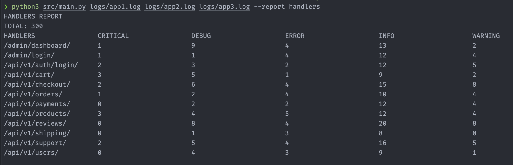
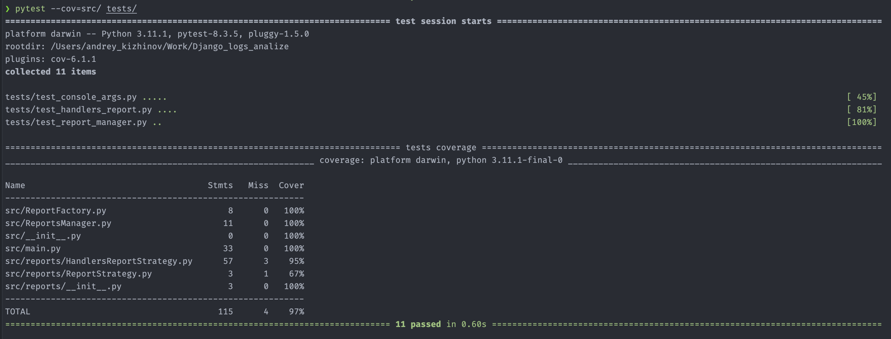

# Консольное приложения для составления отчета по логам

## Настройка и запуск

Для запуска скрипта потребуется Python и библиотека pytest

1) Установите pytest командой `pip install -r requirements.txt`
2) Запустите скрипт командой `python3 src/main.py <log_files...> --report handlers`. Для удобства тестовые скрипты
   уже загружены в папку logs и можно выполнить команду
   `python3 src/main.py logs/app1.log logs/app2.log logs/app3.log --report handlers`
3) Можно проверить тесты и покрытие командой `pytest --cov=src/ tests/ -vv`

## Архитектура решения

### main.py

Это основной скрипт который запускается пользователем. В нем имплементировали две главные функции.

1) Проверка корректности переданных аргументов. Проверяется существование файлов по пути, наличие файлов логов и наличие
   указания какой отчет формировать
2) Запуск ReportsManager для печати отчета

### ReportsManager

Это класс, который отвечает за запуск команды отчетов. Он получает название отчета, получает класс этого отчета при
помощи фабрики и печатает результаты отчета, если фабрика не нашла такое имя, то менеджер бросит исключении о
несуществующем названии отчета.

### ReportFactory

Класс паттерна фабрики, который по переданному названию отчета возвращает класс стратегии для выполнения.

### reports/ReportStrategy

Базовый класс который используется в аннотации типов в классе фабрики.

### reports/HandlersReportStrategy

Класс наследник от стратегии. Как раз в этом классе и формируется весь отчет. По шагам это выглядит так:

1) Для каждого файла, который указан в аргументах мы запускаем парсер.
2) Парсер создает словари вида `{URL: {INFO: 1, DEBUG: 1,...}, ...}`. Уровень логирования и урл достается при помощи
   регулярных выражений. Если мы разбираем строку лога, в которой не указан URL, то привязываем его к предыдущему URL.
3) Дальше каждый словарь мержится в один общий словарь.
4) В конце составляется таблица по dict. По сути мы агрегируем нашу форму dict[dict[str, int]] в таблицу. В классе так
   же константой вынесена ширина таблицы для удобства чтения

Так-же в этом классе, если какая-то строка не прошла паттерн, мы продолжаем идти по файлу игнорируя ее.

### Пример отчета



## Добавление нового отчета

Для добавления нового отчета нужно совершить несколько простых действий:

1) Отнаследовать класс нового отчета от reports/ReportStrategy и перегрузить generate_report
2) Добавить новую стратегию в класс фабрики, например вот так:

```python
class ReportFactory:
    @staticmethod
    def get_report(report_name: str) -> ReportStrategy | None:
        name = report_name.lower()
        if name == "handlers":
            return HandlersReportStrategy()
        elif name == "new_report":
            return NewReportStrategy()
        else:
            raise ValueError("No such report exist")

```

## Тестирование

Тесты были написано с помощью библиотеке pytest и хранятся в папке tests. Покрытие тестами составляет 97% по pytest-cov.

